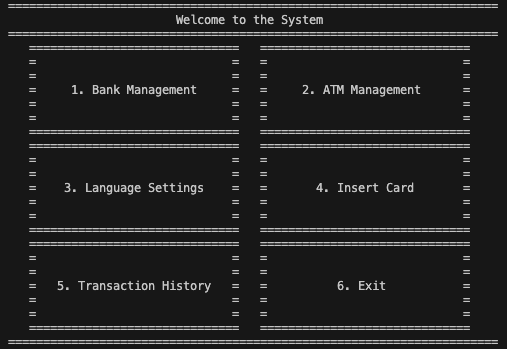

# CSE201 Term Project - Automated Teller Machine (ATM) System (Fall 2024)

## 📌 Project Overview

This is the official implementation for the **CSE201 Term Project** (Fall 2024), focusing on designing and building a **console-based ATM (Automated Teller Machine)** system using **Object-Oriented Programming (OOP)** principles in C++. The system simulates interactions among users, ATMs, and banks, allowing for typical banking operations such as deposit, withdrawal, transfer, and admin management.

## 👥 Team Members

Kyuwon, Joohyeok, Jaeheon, Seonae

## Features

- **User Authentication**
  - Card insertion and password verification
  - Session-based login with up to 3 password attempts
- **Deposits**
  - Cash and check deposits
  - Fee calculations based on primary/non-primary bank
- **Withdrawals**
  - Optimized bill dispensing with denomination prioritization
  - Limits per transaction and session
- **Transfers**
  - Account-to-account and cash transfers
  - Dynamic fee structure based on bank relation
- **Transaction History**
  - Admin-only access
  - History log printed to file and console
- **Multi-language Support**
  - English-only or bilingual (English/Korean) menu options
- **Console UI Simulation**
  - Keypad input, text display, card insert simulation, etc.
- **Snapshot Display**
  - Slash (`/`) input prints current account balances and ATM remaining cash
- **Robust Exception Handling**
  - Invalid inputs, insufficient balance, exceeded limits, etc.

## 💡 Object-Oriented Design

We applied core OOP concepts such as:

- **Encapsulation**: Secure internal data using private fields with public getters/setters
- **Inheritance**: Specialized ATM types (e.g., SingleBankATM, MultiBankATM)
- **Polymorphism**: Abstract base classes for transactions
- **Abstraction**: Simplified interfaces for complex operations (e.g., ATM interface)
- **Exception Handling**: Catching input errors and edge cases gracefully
